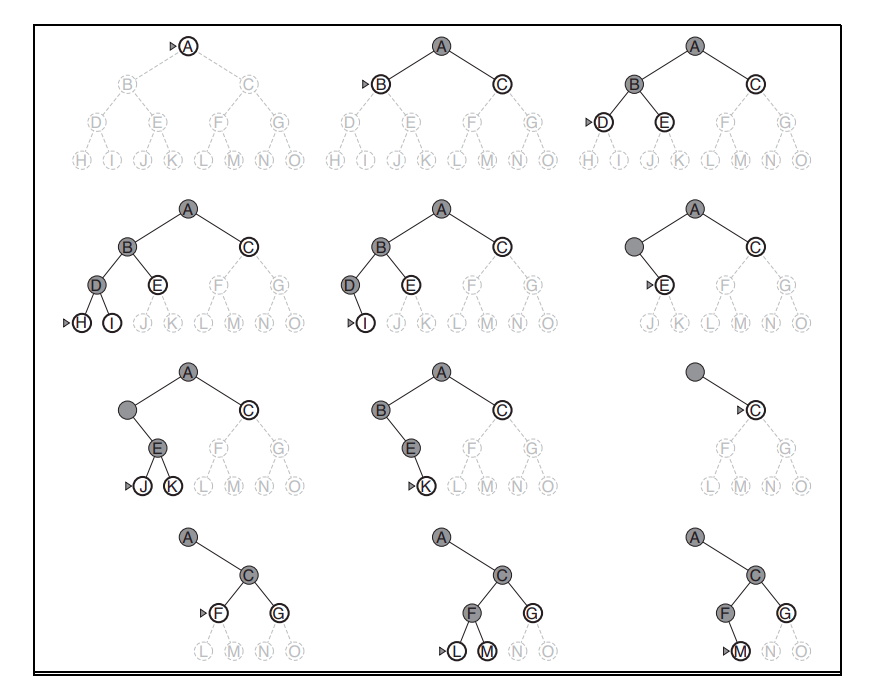

## Introduction

Depth First Search (DFS) is an uninformed search algorithm for traversing a graph. DFS explores as far as possible along each branch of a search tree it creates, before backtracking and exploring the next branch. It uses a LIFO (Last In First Out) queue to keep track of the vertices yet to be explored and visits the child vertices before visiting the neighbor vertices. A LIFO queue means that the most recently generated node is chosen for expansion. The search proceeds immediately to the deepest level of the search tree, where the nodes have no successors. It is a fundamental algorithm used in various applications such as maze solving, topological sorting, and finding connected components due to its simplicity and efficiency.

## Algorithm

The DFS algorithm explores the graph by visiting child vertices before visiting the neighbor vertices. It uses a stack (LIFO queue) to keep track of the vertices yet to be explored. Here are the steps for the DFS algorithm based on graph traversal:

STEP 1: Set visited as 0 for all nodes in the Graph.

STEP 2: Create an empty stack and push the selected root node onto the stack.

STEP 3: While the stack is not empty, do the following:
Pop a node N from the stack.
If N has not been visited, mark it as visited (visited[N] = 1) and process it (e.g., print it or perform an operation).
Push all the unvisited child nodes of N onto the stack.

STEP 4: Repeat step 3 until the stack is empty.

STEP 5: EXIT

## Example 

**Tree Formation**
During the execution of DFS on a graph, a depth-first search tree (also known as a DFS tree) is formed. The DFS tree is an undirected tree that represents the exploration of the graph starting from a particular vertex. Each vertex in the DFS tree has a parent vertex, except for the source vertex, which acts as the root of the tree.

The DFS tree can provide valuable information about the structure of the graph. For example, it can help identify cycles in an undirected graph.

**Time Complexity: O(bm)**
For a depth-first tree with branching factor b (the maximum number of children any node can have), the root of the search tree generates b nodes at the first level, each of which generates b more nodes, for a total of b2 at the second level. Each of these generates b more nodes, yielding b3 nodes at the third level, and so on. A depth-first tree search may generate all of the nodes in the search tree. Then the total number of nodes generated is b + b2 + b3 + ··· + bm = O(bm) where m is the maximum depth of the tree.

**Space Complexity: O(bm)**
A depth-first tree search needs to store only a single path from the root to a leaf node, along with the remaining unexpanded sibling nodes for each node on the path. Once a node has been expanded, it can be removed from memory as soon as all its descendants have been fully explored. For a state space with branching factor b and maximum depth m, since there are m nodes on the path from root to a leaf node and each node has b siblings, the space complexity is O(bm).

## Advantages 

Simplicity: DFS is relatively easy to understand and implement (either as a recursion or using an explicit stack).
Memory Efficiency: DFS uses a small amount of memory as it only needs to store information about the current path being explored as opposed to some other search algorithms like BFS (Breadth First Search). 
Versatility: DFS can be applied to both directed and undirected graphs and can be modified to solve various graph-related problems.

## Disadvantages

Completeness: DFS may not find a solution if the target vertex is not reachable from the source vertex.
Optimal Solutions: DFS does not necessarily find the shortest path or the most optimal solution. It may find a solution, but it might not be the best one in terms of, for example, path length or cost.
Infinite Graphs: When dealing with infinite graphs or graphs with cycles, DFS can get stuck in an infinite loop if not properly handled.
